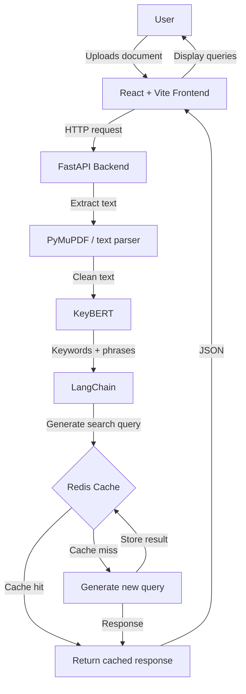

# Curator

**Curator extracts keywords from your documents and generates search queries to help you research better.**

[](https://opensource.org/licenses/MIT)
[](https://www.python.org/downloads/)
[](https://fastapi.tiangolo.com/)
[](https://reactjs.org/)


## Overview

Curator is a full-stack research assistant that automates the bridge between *reading* and *searching*. Upload any document (PDF, text), and Curator extracts the most meaningful keywords and key phrases using **KeyBERT**, then generates tailored search queries to accelerate your research workflow.

Whether you're a student reviewing literature, a researcher surveying papers, or a knowledge worker synthesizing information, Curator helps you go from "what did I just read?" to "what should I read next?" in seconds.

## Architecture



### Flow Breakdown

1. **User uploads** a document via the React frontend (drag-and-drop supported).
2. **FastAPI backend** receives the file and extracts raw text using `PyMuPDF`.
3. **KeyBERT** processes the text to extract the most relevant keywords and key phrases.
4. **LangChain** takes those keywords and constructs a natural-language search query optimized for research databases.
5. **Redis cache** checks if an identical document has been processed before—if so, returns cached results instantly.
6. **Response** is sent back to the frontend and displayed to the user.

## Tech Stack

### Backend
| Technology | Purpose |
|------------|---------|
| **FastAPI** | High-performance async API framework |
| **KeyBERT** | Keyword extraction using BERT embeddings |
| **LangChain** | Query generation and LLM orchestration |
| **PyMuPDF** | PDF text extraction |
| **Redis** | In-memory caching for processed documents |
| **PyTorch (CPU)** | Embedding computation backend |
| **SlowAPI** | Rate limiting |
| **Uvicorn** | ASGI server |

### Frontend
| Technology | Purpose |
|------------|---------|
| **React 19** | UI framework |
| **TypeScript** | Type-safe development |
| **Vite** | Build tool with HMR |
| **Tailwind CSS** | Utility-first styling |
| **TanStack Query** | Server-state management & caching |
| **React Dropzone** | File upload handling |
| **Sonner** | Toast notifications |

### Infrastructure
| Technology | Purpose |
|------------|---------|
| **Docker** | Containerization |
| **PostgreSQL** | Persistent storage |
| **Husky** | Git hooks for code quality |

## Why These Tech Choices?

### KeyBERT vs. Alternatives
KeyBERT uses sentence-transformers to extract keywords via BERT embeddings, capturing semantic meaning rather than just statistical frequency. Alternatives like RAKE or YAKE are faster but rely on statistical patterns and miss contextual nuance. KeyBERT offers a pragmatic middle ground: more accurate than pure statistical methods, lighter than fine-tuning a full LLM for extraction.

### CPU vs. GPU
The backend is configured to run on CPU using `torch==2.8.0+cpu`. This is a deliberate trade-off: GPU acceleration would speed up embedding generation significantly, but it adds cost, complexity, and hardware requirements that would make the project inaccessible to most users. CPU-only deployment keeps Curator **reproducible and affordable** and any modern machine can run it. The performance hit is acceptable for document-sized workloads (seconds, not minutes).

### Redis for Caching
Redis was chosen over simpler in-memory Python dicts or file-based caching for three reasons:
- **Persistence**: Redis survives container restarts, unlike process memory.
- **Distributed-ready**: If the app scales to multiple backend instances, Redis provides a shared cache.
- **TTL support**: Automatic expiration prevents unbounded memory growth.

The cache key is a hash of the document content; identical documents return instantly without re-running the embedding pipeline.

### LangChain for Query Generation
LangChain provides a clean abstraction for prompt templating and LLM interaction. While a raw OpenAI API call would work, LangChain makes it easy to swap models, add memory, or chain more complex reasoning steps in the future without rewriting core logic.

### FastAPI over Flask or Django
FastAPI offers automatic OpenAPI documentation, async support, and Pydantic validation out of the box. For a modern ML-powered service, these features reduce boilerplate and improve developer experience significantly.

### React + TypeScript + Vite
This combination prioritizes **developer productivity** and **type safety**. Vite's HMR makes UI iteration fast; TypeScript catches bugs at compile time; React 19's concurrent features keep the UI responsive during uploads and processing.

## What I'd Do Differently

Every project is a learning opportunity. Here's what I'd change given more time or a second pass:

### 1. Async Background Processing
Currently, the API blocks while KeyBERT and LangChain run. For larger documents (50+ pages), this could time out. I'd implement a **task queue** (Celery or Arq) with WebSocket progress updates so users aren't staring at a loading spinner.

### 2. Embedding Model Caching
KeyBERT loads the embedding model on every request in the current implementation. Pre-loading the model at startup and reusing it across requests would reduce latency significantly.

### 3. More Robust Text Chunking
Long documents exceed embedding context windows. I'd add **semantic chunking** by splitting text by paragraphs or sections rather than arbitrary token limit, to preserve meaning during extraction.

### 4. GPU Support as an Optional Flag
While CPU-only keeps the project accessible, I'd add a `--gpu` launch flag that uses `torch` with CUDA when available, giving users with compatible hardware a speed boost.

### 5. Better Error Handling & Retries
PDFs can be corrupted or contain non-text elements (scanned images, complex tables). I'd integrate **OCR fallback** (Tesseract) and more graceful failure messaging.

### 6. User Accounts & History
The current version is stateless per session. Adding authentication would let users save their query history and build a personal research knowledge base over time.

### 7. More Comprehensive Testing
Unit tests exist but coverage could be expanded, especially around edge cases like empty documents, non-UTF-8 text, and malformed PDFs.

## Getting Started

### Prerequisites
- Python 3.10+
- Node.js 18+
- Docker (optional)

### Running with Docker Compose

```bash
git clone https://github.com/fagbenjaenoch/curator.git
cd curator
docker-compose up --build
```

Access the frontend at `http://localhost:5173` and the API at `http://localhost:8000`.

### Running Locally

**Backend:**
```bash
cd app/backend
uv venv
source .venv/bin/activate  # Windows: .venv\Scripts\activate
uv pip install -e .
uvicorn main:app --reload
```

**Frontend:**
```bash
cd app/frontend
npm install
npm run dev
```

---

## License

Licensed under the [MIT License](LICENSE).

## Acknowledgments

Built with ❤️ using open-source tools: KeyBERT, LangChain, FastAPI, React, and the broader NLP community.
